# FINGER PRINT RECOGINATION USING CNN - A full stack web/android App for fingerprint Recogination 😀😍💗🔥


A Full stack Fingerprint Recogination web/android App with deep learning and flask 😍

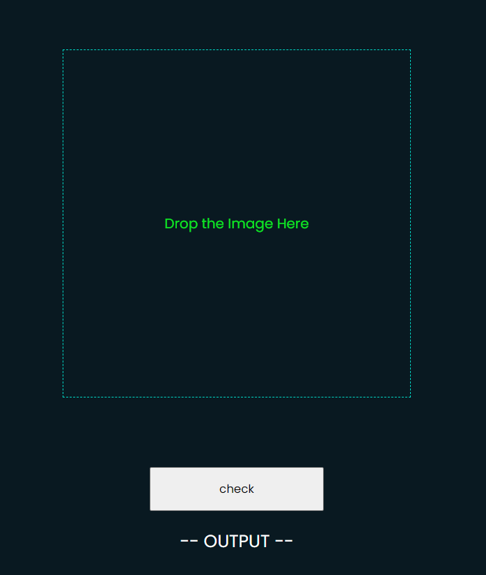

## Preview - Finger Print Recogination 🌟

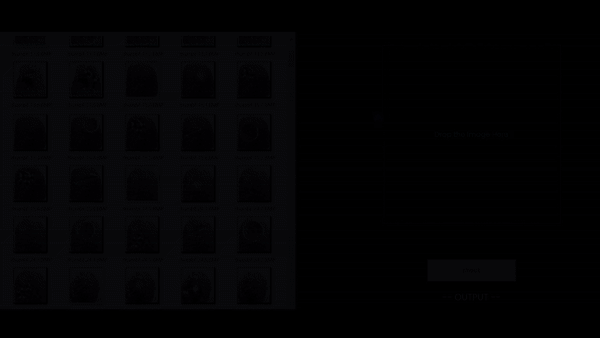

# Steps of Fingerprint Recogination ❤️

<table style="width:100%">
  <tr>
    <th>1. select Image </th>
    <th>2. image selected </th> 
    <th>3. output </th>
  </tr>
  <tr>
    <td></td> 
    <td>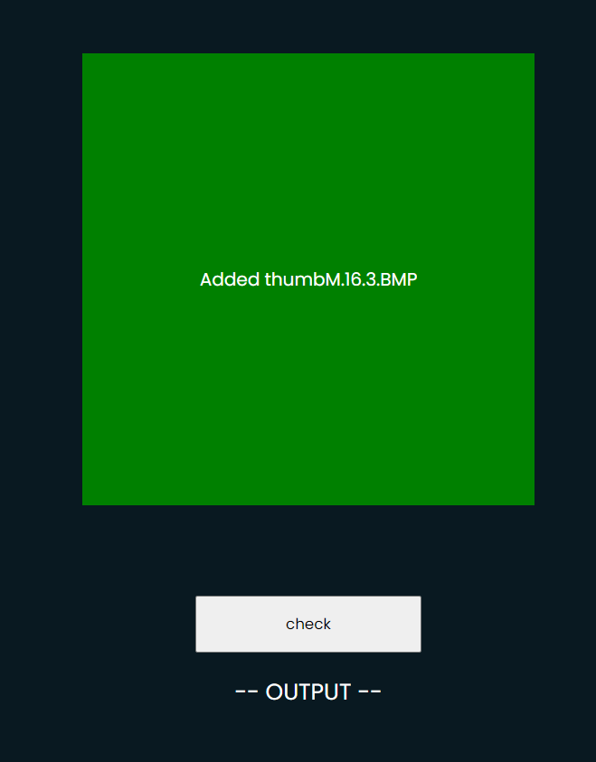</td>
    <td>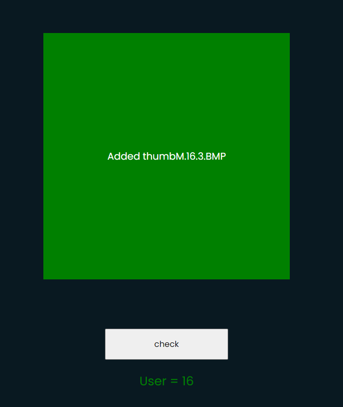</td> 
  </tr>
</table>

## About 🤗

This is <b>static</b> fingerprint recogination application 🖥 where the model is trainded in the backend using cnn 💻 i.e <i>Convolutional Neural Network</i>and front end is in html,css , and javascript . the json api is build using flask server and deep learning model .

The poject is basically focused on the machine learning part where we can visualize the output after passing through each convolution and pooling . if we provide a single fingerprint image then after passing through each layer how the image is changing we can see in this project .

## Diagram of the model 💎

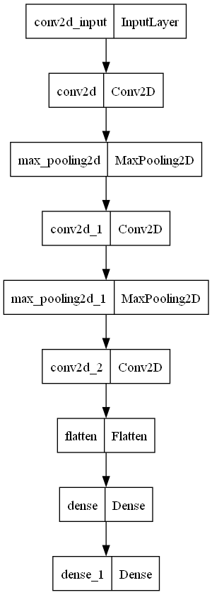

## After passing through each layer the image changes as follows : 🛴

### Step 1. This Image is passed to Model for Checking


this is the image with 103 X 96 px

<br>
<br>
### Step 2. After passing through first Convolutional layer we get this output

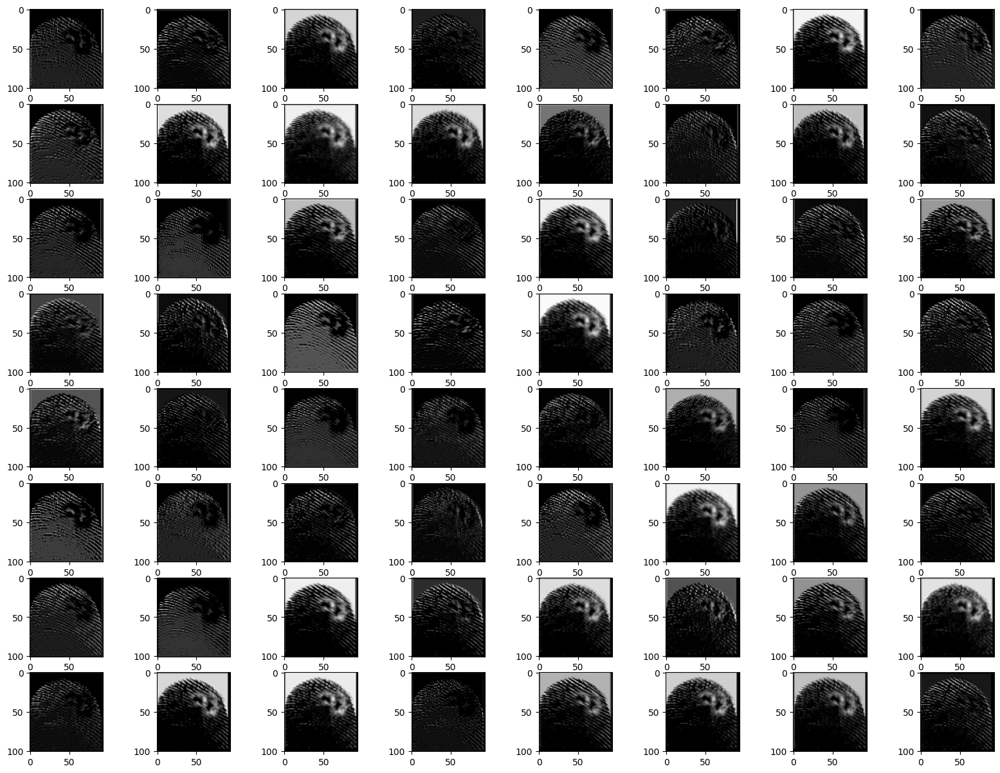

since there are 64 filters with 3x3 each so the total images created is 64 and size reduced to 101 X 94 px i.e (103-(3-1),96-(3-1))

<br>
<br>

### Step 3. After passing through polling layer we get this

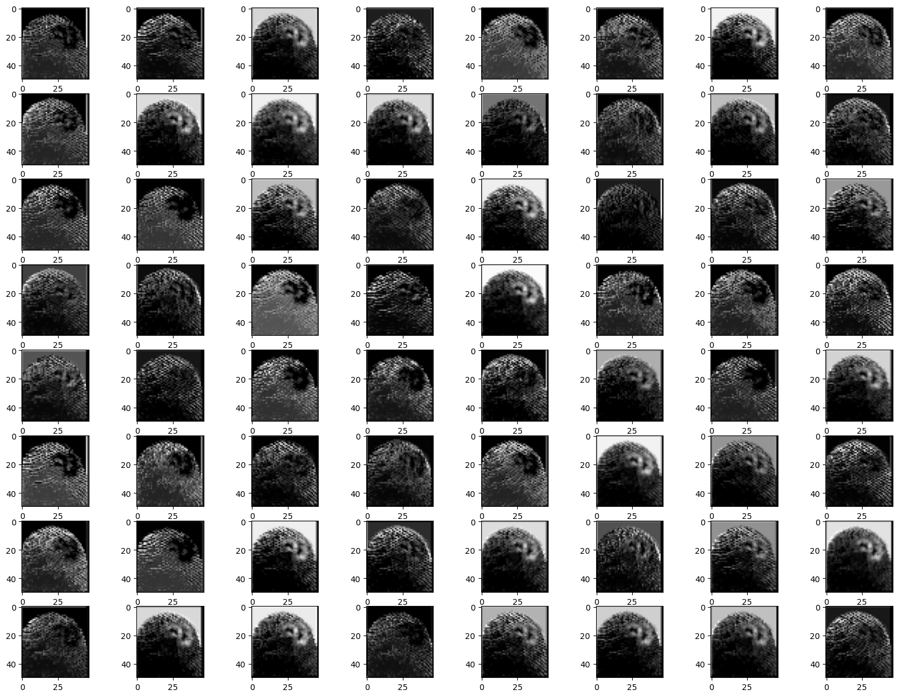

after passing through polling layer we get 64 images with 50 X 47 px each . pool filter is of 2x2 so the size = (101/2,94/2) max among two pixes . so size reduced to half .

<br>
<br>

### Step 4. After passing through the second convolutional layer we get

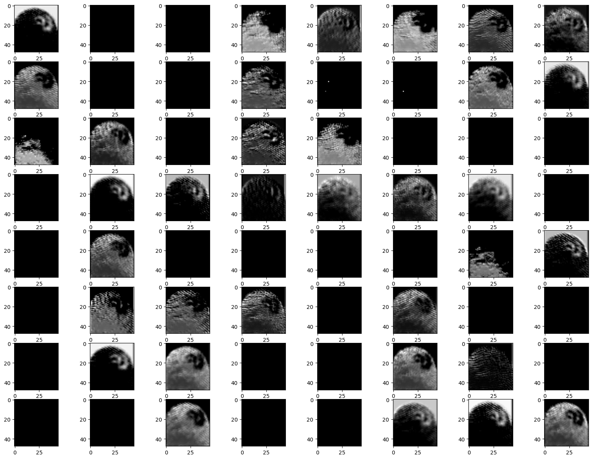

since there are 64 filters with 3x3 each so the total imgages created is 64 and size reduced to 48 X 45 px

<br>
<br>

### Step 5 . After passing through polling layer we get this

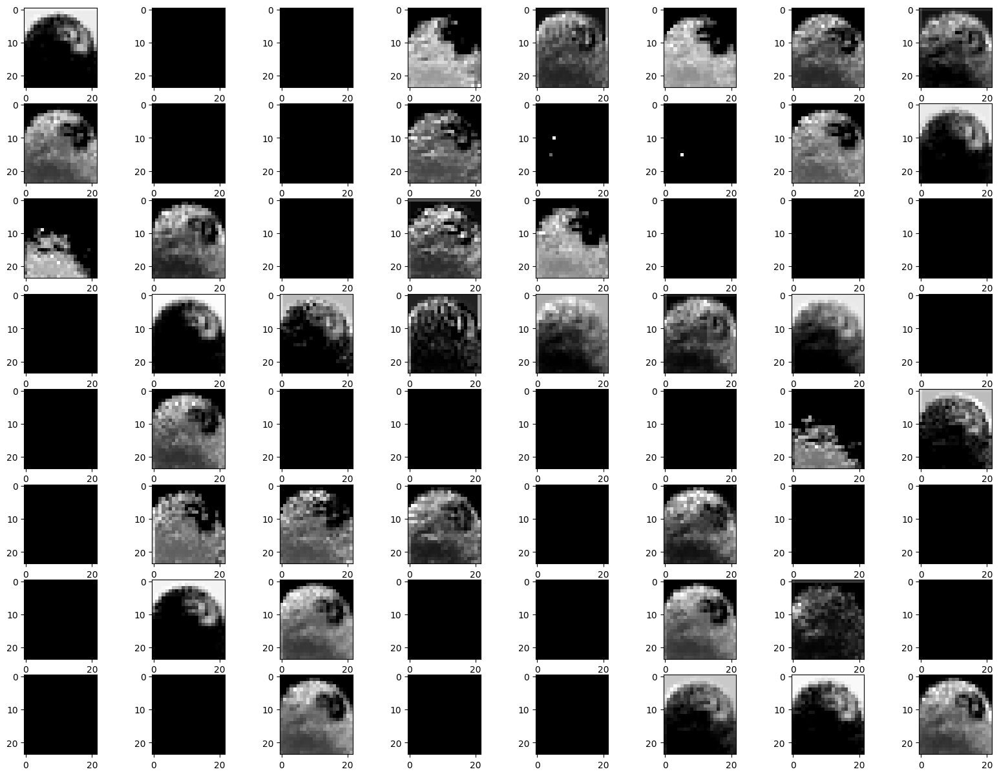

fter passing through polling layer we get 64 images with 24 X 22 px each

<br>
<br>

### Step 6 . After passing through third convolution layer we get

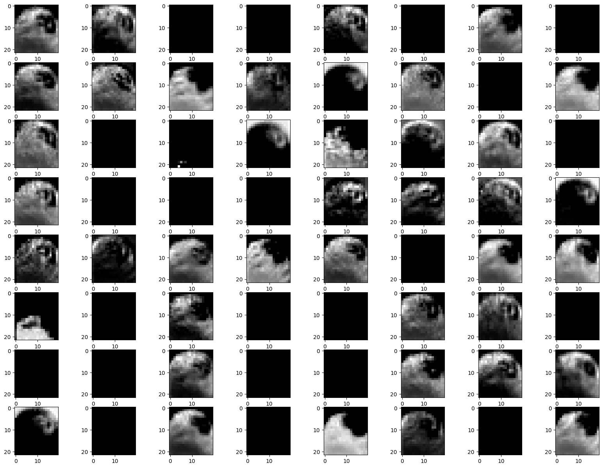

since there are 64 filters with 3x3 each so the total imgages created is 64 and size reduced to 22 X 20 px

<br>
<br>

### Step 7 . flatten the pixels and ploted in bar graph

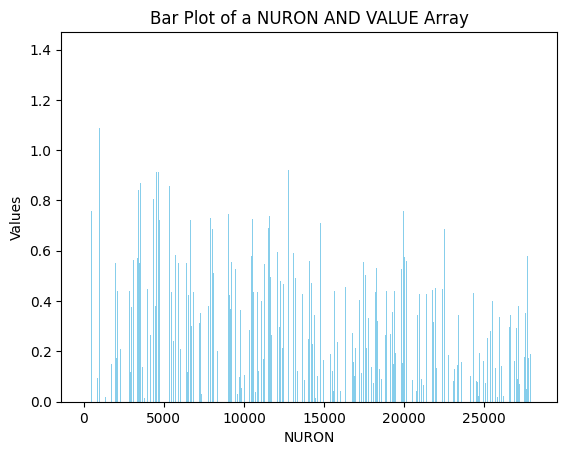

since there are 64 images with 22 X 20 px . so total number of input dat will be 22X20X64 = 28160

<br>
<br>

### Step 8 . Now it comes under dense layer with 64 neurons

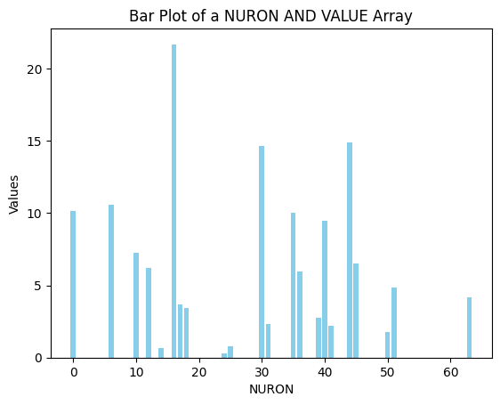

we can see what different neurons calculate their output using relu activation function

<br>
<br>

### Step 9. Now it comes under dense layer with 51 neurons

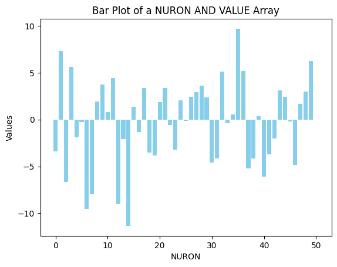

these neurons are calcuting their output through the sigmoid function so the output comes under both region . (+ve and -ve )

<br>
<br>

### Step 10. Max among all the outputs

<table style="width:100%">
  <tr>
    <td>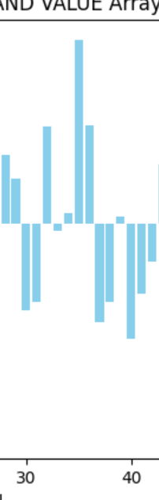</td> 
    <td>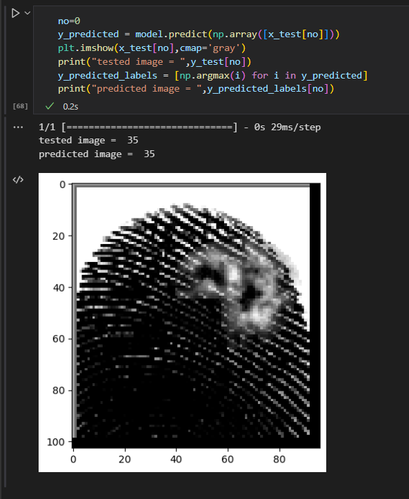</td>
  </tr>
</table>

<br>
<br>

since we can see that the maximum output is for <b>35<b> so the fingerprint is corresponding to 35th person.

<br><br>

## License

```

MIT License

Copyright (c) 2024 VibhavKumar

Permission is hereby granted, free of charge, to any person obtaining a copy
of this software and associated documentation files (the "Software"), to deal
in the Software without restriction, including without limitation the rights
to use, copy, modify, merge, publish, distribute, sublicense, and/or sell
copies of the Software, and to permit persons to whom the Software is
furnished to do so, subject to the following conditions:

The above copyright notice and this permission notice shall be included in all
copies or substantial portions of the Software.

THE SOFTWARE IS PROVIDED "AS IS", WITHOUT WARRANTY OF ANY KIND, EXPRESS OR
IMPLIED, INCLUDING BUT NOT LIMITED TO THE WARRANTIES OF MERCHANTABILITY,
FITNESS FOR A PARTICULAR PURPOSE AND NONINFRINGEMENT. IN NO EVENT SHALL THE
AUTHORS OR COPYRIGHT HOLDERS BE LIABLE FOR ANY CLAIM, DAMAGES OR OTHER
LIABILITY, WHETHER IN AN ACTION OF CONTRACT, TORT OR OTHERWISE, ARISING FROM,
OUT OF OR IN CONNECTION WITH THE SOFTWARE OR THE USE OR OTHER DEALINGS IN THE
SOFTWARE.


```
